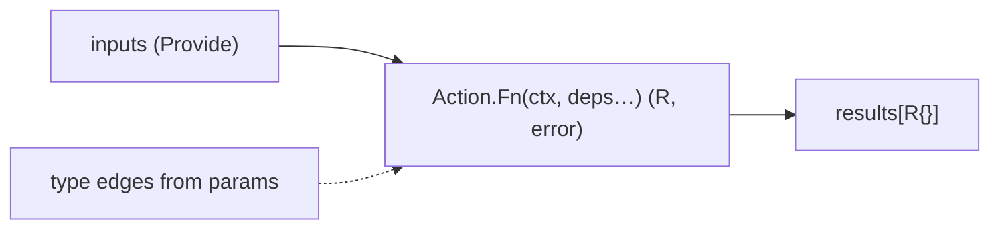

<p align="center">
  
</p>

<p align="center">
  <a href="https://github.com/ruivieira/goblin/actions/workflows/ci.yml"></a>
  <a href="https://pkg.go.dev/github.com/ruivieira/goblin"></a>
  <a href="https://codecov.io/gh/ruivieira/goblin"></a>
  <a href="https://goreportcard.com/report/github.com/ruivieira/goblin"></a>
</p>

# Goblin

Type-driven DAG runner for Go workflows. Goblin wraps [`go-future/dagfunc`](https://github.com/jizhuozhi/go-future) with named **Actions**, structured logging, optional validate/compensate hooks, and a registry.

Module: `github.com/ruivieira/goblin`.

Consumers can depend on the module and point at a local checkout with a `replace` directive:

```go
replace github.com/ruivieira/goblin => /path/to/goblin
```

## Concepts

| Term | Meaning |
| ---- | ------- |
| **Flow** | A composition that calls `goblin.Run` with inputs and steps |
| **Action** | A named step (`Name`, `Description`, `Fn`) registered into the DAG |
| **Input / seed** | A comparable typed value `Provide`d into the DAG (config, `Deps`, …) |
| **Result / milestone** | The `R` in `func(ctx, …) (R, error)` — also the DAG node identity |
| **Phantom dep** | An unused parameter (e.g. `_ StageReady`) that forces ordering |

Edges are inferred from **parameter types** after `context.Context`. Each return type `R` must be unique in a given DAG.



## Quick start

```go
package main

import (
	"context"

	"github.com/ruivieira/goblin"
)

type GreetConfig struct{ Name string }
type Greeted struct{ Msg string }

func greet(_ context.Context, deps goblin.Deps, cfg GreetConfig) (Greeted, error) {
	deps.Logger.TaskInfo("greet", "hello "+cfg.Name)
	return Greeted{Msg: "hello " + cfg.Name}, nil
}

var Greet = goblin.New(goblin.Spec{
	Name:        "greet",
	Description: "Emit a greeting",
	Fn:          greet,
})

func main() {
	logger := &goblin.Logger{Flow: "demo"}
	deps := goblin.Deps{Logger: logger}
	_ = goblin.Run(context.Background(), logger,
		[]any{deps, GreetConfig{Name: "goblin"}},
		[]any{Greet},
		func(results map[any]any) {
			g := results[Greeted{}].(Greeted)
			logger.FlowInfo(g.Msg)
		},
	)
}
```

## Authoring an Action

1. Write an unexported function with signature `func(context.Context, …) (R, error)`.
2. Do **not** call `goblin.Do` / `DoValue` in the body — `Run` auto-wraps logging using `Name()`.
3. Export a `var` built with `goblin.New`.
4. Register it (`goblin.Register` in package `init`).

```go
func prepareStage(ctx context.Context, deps goblin.Deps, cfg StageConfig) (StageReady, error) {
	// work…
	return StageReady{Name: cfg.Name, Created: true}, nil
}

func compensatePrepareStage(ctx context.Context, r StageReady) error {
	if !r.Created {
		return nil
	}
	// undo…
	return nil
}

var PrepareStage = goblin.New(goblin.Spec{
	Name:        "prepare-stage",
	Description: "Prepare a stage if it does not already exist",
	Fn:          prepareStage,
	Compensate:  compensatePrepareStage, // optional
	// Validate: validatePrepareStage,  // optional
})
```

### Spec fields

| Field | Required | Signature |
| ----- | -------- | --------- |
| `Name` | yes | stable id (also the task log label) |
| `Description` | no | human-readable summary |
| `Fn` | yes | `func(context.Context, …) (R, error)` |
| `Validate` | no | `func(context.Context, same deps as Fn…) error` |
| `Compensate` | no | `func(context.Context, R) error` |

`New` panics if `Name`/`Fn` are missing or signatures do not match.

### Optional interfaces

```go
type Action interface {
	Name() string
	Description() string
	Fn() any
}

type Validator interface {
	ValidateFn() any // same deps as Fn → error
}

type Compensator interface {
	CompensateFn() any // (ctx, R) → error
}
```

`goblin.New` returns a value that implements these when `Validate` / `Compensate` are set.

## Running a flow

```go
logger := &goblin.Logger{Flow: "deploy-app"}
deps := goblin.Deps{Logger: logger}

err := goblin.Run(ctx, logger,
	[]any{deps, stageCfg, appCfg},                 // inputs
	[]any{PrepareStage, DeployApp},                // steps
	func(results map[any]any) {
		deployed = results[AppDeployed{}].(AppDeployed)
	},
)
```

### What `Run` does for each Action

1. **Validate** (if present) — fail fast, log as failed task  
2. **Execute** `Fn`  
3. **Auto-log** completion via `Do` semantics (`Task run '<Name>'` … `Completed()` / `Failed(…)`)  
4. **Record** success for compensation  

On DAG failure, completed Actions with a compensator run **in reverse order**. Compensate errors are logged; the original DAG error is still returned.

Raw functions are still accepted in `steps` (no auto name/log/compensate) for compatibility.

## Ordering with types

DAG order comes from parameter types, not an edge list.

```go
// DeployApp cannot run until PrepareStage has produced StageReady.
func deployApp(ctx context.Context, deps goblin.Deps, _ StageReady, cfg AppConfig) (AppDeployed, error) {
	// …
}
```

Rules of thumb:

- One input (or result) **per type** in a DAG  
- Result types must be **comparable** (no slices/maps) so they can key `results`  
- Put non-comparable payloads behind a pointer field on a comparable struct if needed  

## Logging

```go
logger := &goblin.Logger{Flow: "my-flow"}
deps := goblin.Deps{Logger: logger}

deps.Logger.TaskInfo("prepare-stage", `prepared stage "demo"`)
// buffered until the Action finishes, then emitted under one Task run header
```

- Prefer `TaskInfo` / `TaskError` with the Action `Name` as the first argument  
- Flow-level: `FlowInfo` / `FlowError`  
- Redirect all console logger output with `goblin.SetOutput(w)` (tests, capture)

`Do` / `DoValue` remain public for rare cases outside Actions; Action bodies should not call them.

### Run info stores

`Logger.Stores` holds one or more [`RunStore`](store.go) adapters that receive structured begin/end events for flows and tasks. When `Stores` is nil or empty, **ConsoleStore** (pterm) is used — the previous default behaviour.

| Adapter | Constructor | Purpose |
| ------- | ----------- | ------- |
| Console | `NewConsoleStore()` | pterm console lines (default) |
| SQLite | `NewSQLiteStore(path)` | Persist runs/tasks (pure Go, `modernc.org/sqlite`) |
| Syslog | `NewSyslogStore(w)` / `NewSyslogFileStore(path)` | BSD syslog **RFC 3164** text lines |

Use more than one via `MultiStore` (or a `Stores` slice):

```go
sqlite, err := goblin.NewSQLiteStore("/var/lib/app/goblin-runs.db")
if err != nil {
	log.Fatal(err)
}
defer sqlite.Close()

logger := &goblin.Logger{
	Flow: "deploy-app",
	Stores: []goblin.RunStore{
		goblin.MultiStore(goblin.NewConsoleStore(), sqlite),
	},
}
```

Custom backends (JSON, Apache Combined, …) implement `RunStore`. Ad-hoc flow messages can also implement optional `FlowMessenger`.

## YAML flows

Goblin can parse, validate, and run flow documents (`kind: goblin/v1`):

```yaml
name: My flow
kind: goblin/v1
parameters:
  foo: "world"
steps:
  - id: greet
    action: greet
    with:
      name: ${foo}
```

A small fixture lives at [`testdata/greet.yaml`](testdata/greet.yaml).

| API | Role |
| --- | ---- |
| `Parse` / `ParseFile` / `ParseFS` | Load a `Document` from bytes, disk, or `fs.FS` (`embed.FS`) |
| `Validate` | Check kind, ids, registered actions, and `${param}` refs |
| `RunYAML` / `RunYAMLFile` / `RunYAMLFS` | Interpolate → bind `with` onto typed seeds → `Run` |
| `JSONSchema` / `InstallJSONSchema` | Build draft-07 JSON Schema from the action registry for editor autocomplete |

`${name}` is whole-token only: a `with` value that is exactly `${foo}` is replaced by the parameter’s typed value.

```go
//go:embed flows/*.yaml
var flowFS embed.FS

err := goblin.RunYAMLFS(ctx, logger, flowFS, "flows/my-flow.yaml")
```

### Editor autocomplete (JSON Schema)

Generate and install a schema from registered Actions:

```go
_ = goblin.InstallJSONSchema(goblin.DefaultSchemaPath())
// or: goblin.WriteJSONSchema(os.Stdout)
```

Default path: `${XDG_CONFIG_HOME:-~/.config}/goblin/goblin-v1.json`.

**Important:** Some YAML language servers do not expand `~` in `yaml.schemas` keys. Use a workspace-relative path, a `file:///absolute/path` URI, or a modeline:

```yaml
# yaml-language-server: $schema=./goblin-v1.json
```

Editors: Cursor/VS Code `yaml.schemas`, Emacs `lsp-yaml-schemas` (requires `yaml-language-server` on `PATH`).

Limitations:

- DAG edges still come from Action parameter types — YAML has no `needs` / `depends_on`
- At most one `Provide` per seed type per flow
- Seeds must be YAML-friendly comparable structs; complex pointer seeds will not bind from `with`
- Actions must be registered before `Validate` / `RunYAML`

## Registry

```go
goblin.Register(PrepareStage) // panic on duplicate Name

for _, a := range goblin.All() {
	fmt.Println(a.Name(), a.Description())
}
a := goblin.ByName("prepare-stage")
```

Register Actions in package `init`. Blank-import task packages from a single aggregator so the registry is populated before `Run` / `Validate`.

## Layout

```
github.com/ruivieira/goblin   ← this library
your-app/internal/tasks/      ← Action implementations (consumer)
your-app/internal/flows/      ← goblin.Run compositions (consumer)
```

## Tests

```bash
go test ./... -race -cover
```

CI also runs `golangci-lint`, `gosec`, and `govulncheck`, and fails if statement coverage drops below 85%.

Call an Action’s implementation from unit tests via `Fn()`:

```go
fn := PrepareStage.Fn().(func(context.Context, goblin.Deps, StageConfig) (StageReady, error))
ready, err := fn(ctx, deps, cfg)
```

## Checklist: new Action

1. [ ] Comparable config / result types  
2. [ ] Unexported `fn` — no inner `goblin.Do`  
3. [ ] `var Name = goblin.New(Spec{…})`  
4. [ ] Optional `Validate` / `Compensate` only when useful  
5. [ ] `goblin.Register` in package `init`  
6. [ ] Wire into a flow’s `steps` slice  
7. [ ] If brand-new package: blank-import it from your aggregator so `init` runs  
